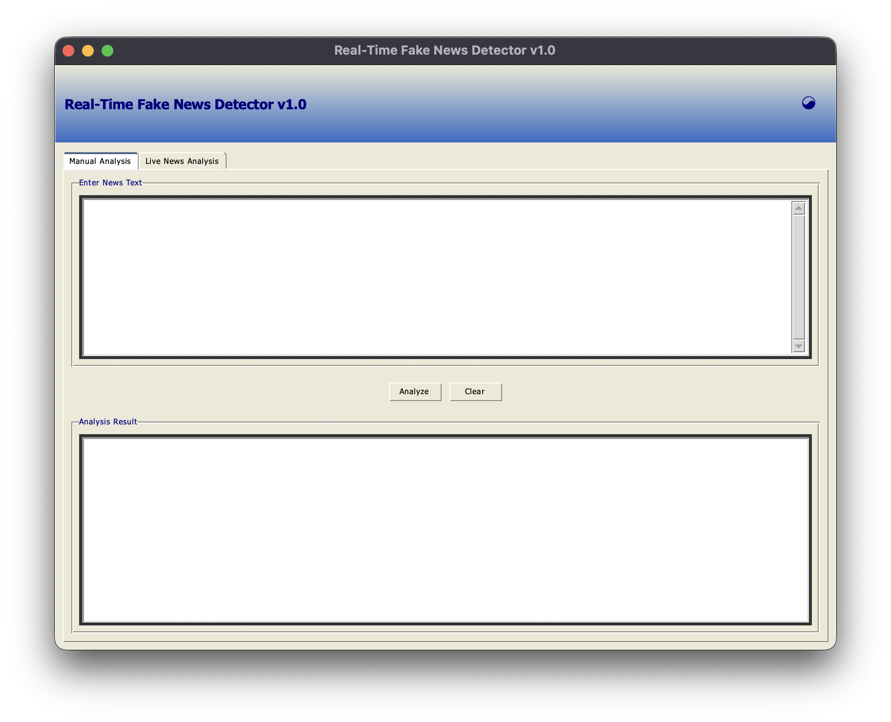
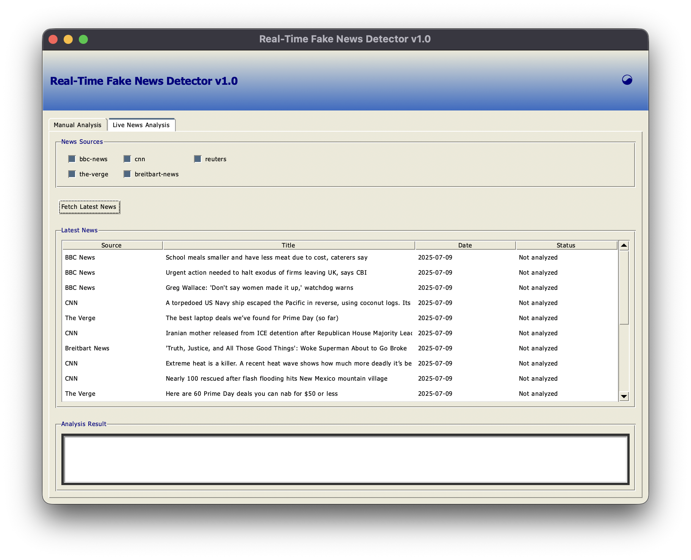

<div align="center">

# 📰 RetroFake-Hunter
**📰 Real Time Fake News Detector - Retro design. Sharp ML. Instant Verdict.**

🪟 A retro styled Windows XP GUI app to detect real vs fake news in real time!  
Branded with 💗 by [Y7X-bit](https://github.com/Y7X-bit)





</div>

---

## ⚡ Features

- 🧠 Manual text based analysis with confidence scores
- 📰 Live news feed scanning (CNN, BBC, Reuters & more)
- ❗ Clickbait detection + suspicious links handling
- 📊 Visual feedback via retro treeview & status bars
- 🪟 Windows XP GUI with tabs, beveled frames & nostalgia
- 💾 Save & bookmark results as `.txt` logs
- 🚀 Runs offline for manual mode (no NewsAPI required)

---

## 🖥️ Installation

> Python 3.9 or later required

```bash
git clone https://github.com/Y7X-bit/RetroFake-Hunter.git
cd RetroFake-Hunter
pip install -r requirements.txt
python RetroFake-Hunter.py GUI